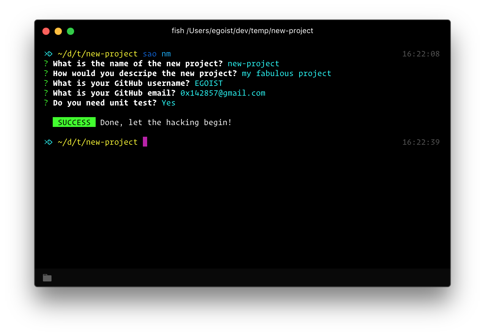

<h1 align="center">template-nm</h1>

<p align="center">
  Scaffolding out a node module.
</p>



## Features

- Unit test with [AVA](https://github.com/avajs/ava)
- ESLint with [xo](https://github.com/sindresorhus/xo) or [standard](https://github.com/feross/standard)
- CircleCI with [Yarn](yarnpkg.com) support

## Usage

Install [SAO](https://github.com/egoist/sao) first.

### From git

```bash
sao egoist/template-nm
```

### From npm

```bash
sao nm
```

## License

MIT &copy; EGOIST
